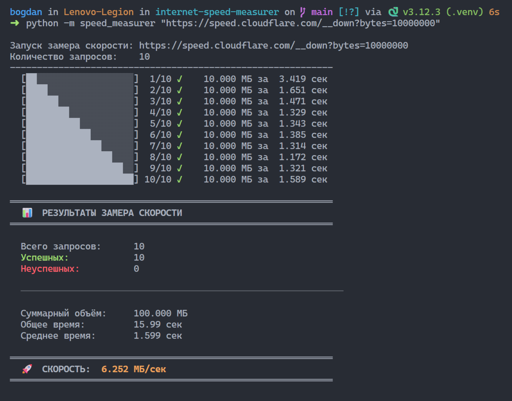
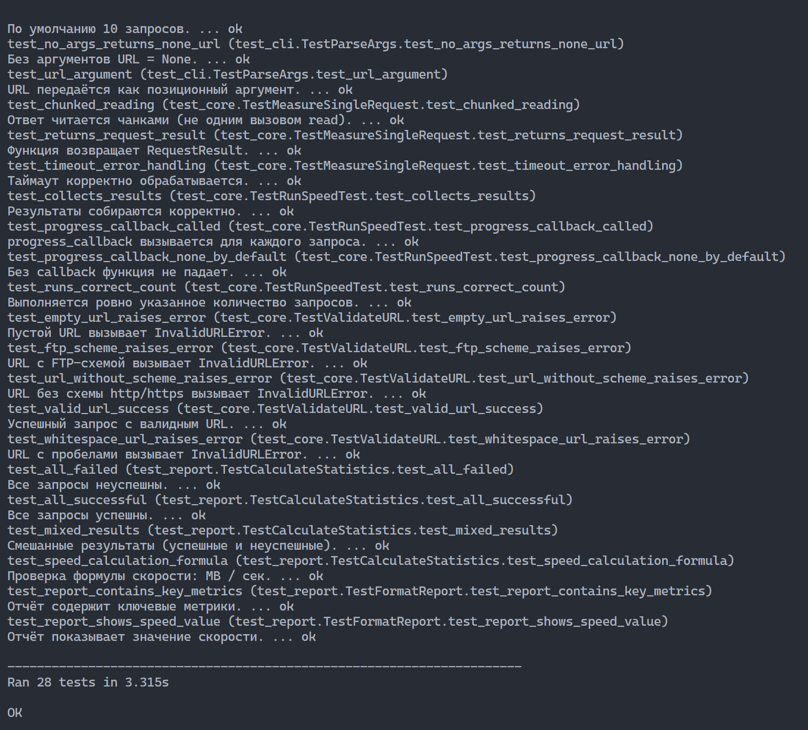

# Speed Measurer

CLI-утилита для замера скорости скачивания. Принимает URL, делает 10
последовательных HTTP-запросов, замеряет время каждого и выводит
среднюю скорость в МБ/с.

Написана на стандартной библиотеке Python — без внешних зависимостей.

## Требования

- Python 3.10+
- Linux / macOS / WSL (ANSI-цвета в выводе)
- Только стандартная библиотека

## Установка

```bash
git clone https://github.com/Bogdan-95/internet-speed-measurer.git
cd internet-speed-measurer

python3 -m venv .venv
source .venv/bin/activate

python -m pip install --upgrade pip
pip install -r requirements.txt    # зависимостей нет, но файл есть
```

Для чистой Ubuntu / WSL сначала доустановить системные пакеты:

```bash
sudo apt update
sudo apt install -y python3 python3-pip python3-venv git
```

## Использование

```bash
# URL аргументом (10 запросов по умолчанию)
python -m speed_measurer https://example.com/image.jpg

# Своё количество запросов
python -m speed_measurer -c 5 https://example.com/file.bin

# Интерактивный ввод URL
python -m speed_measurer

# Справка
python -m speed_measurer --help
```

### Проверенные URL для теста

| URL | Размер | Примечание |
|-----|--------|-----------|
| `https://speed.cloudflare.com/__down?bytes=10000000` | 10 МБ | Cloudflare, без rate limit |
| `https://speed.cloudflare.com/__down?bytes=50000000` | 50 МБ | Cloudflare, для серьёзного замера |
| `https://proof.ovh.net/files/10Mb.dat` | 10 МБ | OVH |
| `https://upload.wikimedia.org/wikipedia/commons/3/3d/LARGE_elevation.jpg` | ~4 МБ | Wikimedia, ⚠️ rate limit на 2–3 запросе |

Перед запуском URL лучше проверять: `curl -I <URL>`. Если ответ `200 OK` — сервер жив.

## Пример работы



```
Запуск замера скорости: https://speed.cloudflare.com/__down?bytes=10000000
Количество запросов:    10
------------------------------------------------------------
  [██░░░░░░░░░░░░░░░░░░]  1/10 ✓    10.000 МБ за  3.419 сек
  [████░░░░░░░░░░░░░░░░]  2/10 ✓    10.000 МБ за  1.651 сек
  ...
  [████████████████████] 10/10 ✓    10.000 МБ за  1.589 сек

════════════════════════════════════════════════════════════
  📊  РЕЗУЛЬТАТЫ ЗАМЕРА СКОРОСТИ
════════════════════════════════════════════════════════════

  Всего запросов:      10
  Успешных:            10
  Неуспешных:          0

  ────────────────────────────────────────────────────────────

  Суммарный объём:     100.000 МБ
  Общее время:         15.99 сек
  Среднее время:       1.599 сек

════════════════════════════════════════════════════════════
  🚀  СКОРОСТЬ:  6.252 МБ/сек
════════════════════════════════════════════════════════════
```

## Как считается скорость

```
скорость (МБ/с) = объём успешных запросов (МБ) / суммарное время успешных запросов (с)
```

Используются **десятичные** мегабайты: 1 МБ = 1 000 000 байт.

Считаем именно `Σbytes / Σtime`, а не среднее арифметическое скоростей —
иначе один медленный запрос искажает картину.

## Обработка ошибок

| Ситуация | Поведение |
|----------|-----------|
| Пустой URL | Сообщение об ошибке, код возврата 1 |
| Нет схемы http/https | То же |
| Таймаут | Запрос помечается неуспешным, серия продолжается |
| Ошибка DNS | То же |
| HTTP 4xx / 5xx | То же |
| Ctrl+C | Прерывание, код 1 |
| Все запросы упали | Итоговое сообщение, код 1 |

## Тесты

28 unit-тестов, без реальных сетевых запросов (используется `unittest.mock`).

```bash
python -m unittest discover tests -v
```



## Структура

```
speed_measurer/
├── __main__.py     точка входа (python -m speed_measurer)
├── cli.py          argparse, интерактивный ввод, main()
├── config.py       константы
├── core.py         HTTP-логика, потоковое чтение
├── exceptions.py   кастомные исключения
└── report.py       подсчёт статистики, вывод
```

## Ограничения

- Замеряется только **скорость скачивания**. Upload, ping, jitter не измеряются.
- Результат зависит от сервера, маршрута, VPN, прокси, загрузки канала и
  времени суток.
- CDN и провайдеры могут кэшировать и шейпить — цифры могут отличаться
  между запусками.
- Публичные test-URL часто умирают. Проверяйте через `curl -I` перед запуском.

## Лицензия

MIT — см. [LICENSE](LICENSE).